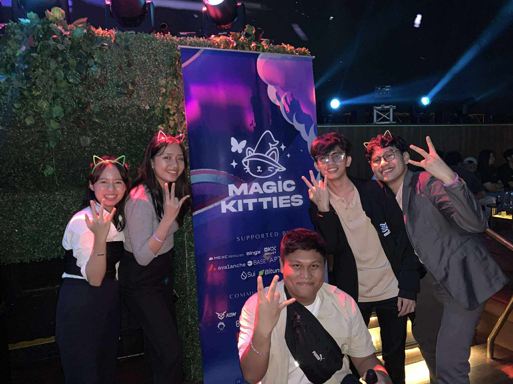
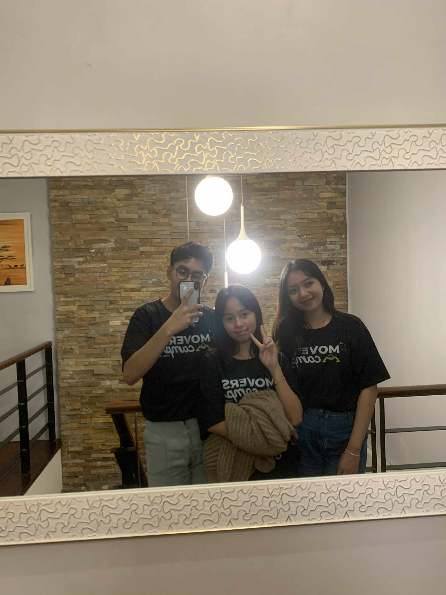
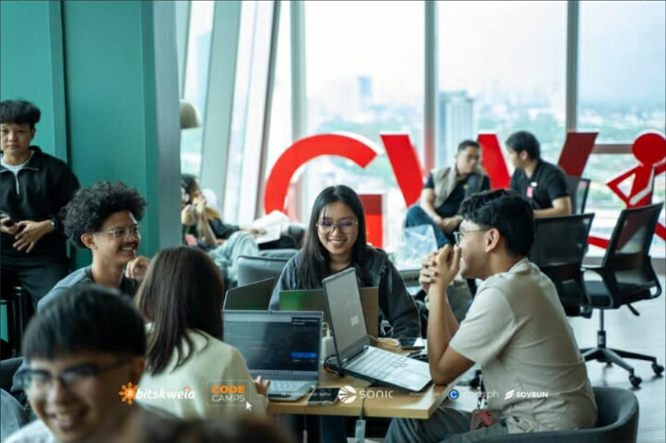

  

<table width="100%">
<tr>
<td width="60%" valign="top">

Hey! I'm **Shine**, a web developer exploring the blockchain space. I'm all about mixing creativity with code, whether it's frontend development, UI design, or brainstorming business ideas. I'm passionate about building innovative Web3 applications and constantly leveling up my backend and blockchain skills along the way.

I'm stronger on the frontend and design side, but I love learning new things, even when it's challenging. When I'm not coding, you'll find me interested about pets, astrology, reading, psychology, movies, or doing some arts and crafts. I believe in building things that matter and collaborating with cool people on open-source projects or startup ideas.

</td>
<td width="30%" valign="top" align="right">

  

  
   
  
   
  

 

  

  
  
  
  
  
  
  
  
  
  
  
  

</td>
</tr>
</table>

  

---

  

---

<table width="100%">
<tr>
<td align="center" width="16.66%">
 
<b>Issue Date</b> 
<a href = "#">Credential Link</a>
<i>Topic</i> 
</td>
<td align="center" width="16.66%">
 
<b>Issue Date</b> 
<a href = "#">Credential Link</a>
<i>Topic</i> 
</td>
<td align="center" width="16.66%">
 
<b>Issue Date</b> 
<a href = "#">Credential Link</a>
<i>Topic</i> 
</td>
<td align="center" width="16.66%">
 
<b>Issue Date</b> 
<a href = "#">Credential Link</a>
<i>Topic</i> 
</td>
<td align="center" width="16.66%">
 
<b>Issue Date</b> 
<a href = "#">Credential Link</a>
<i>Topic</i> 
</td>
</tr>
</table>

  

---

  

    
  

  

    
  

  

    
  

  

    
  

  

    
  

  

---

**"First, solve the problem. Then, write the code."** – John Johnson

  

---

<!-- 

 

 -->

<!--
**0x-sh1ne/0x-sh1ne** is a ✨ _special_ ✨ repository because its `README.md` (this file) appears on your GitHub profile.

Here are some ideas to get you started:

- 🔭 I’m currently working on ...
- 🌱 I’m currently learning ...
- 👯 I’m looking to collaborate on ...
- 🤔 I’m looking for help with ...
- 💬 Ask me about ...
- 📫 How to reach me: ...
- 😄 Pronouns: ...
- ⚡ Fun fact: ...
-->
